# Convolutional Autoencoder Designs for Anomaly Detection

Each branch of this repo contains an implementation of a one-class anomoly detector using different autoencoder designs. Made and tested on Google Colab.

### Branch Directory
* **Basic_AE_MSE:** Basic autoencoder with MSE loss
* **Basic_AE_SSIM:** Basic autoencoder with SSIM loss
* **Beta-VAE:** Variational autoencoder with Beta parameter
* **Denoising_BVAE:** Denoising Beta Variational autoencoder 
* **DAE:** Denoising autoencoder
* **VAE:** Variational autoencoder

Each autoencoder uses the same CNN structure. The CNN encoder is shown below:

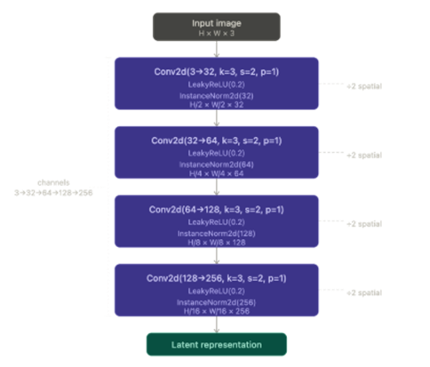

The 'main' branch of this repo contains the final report on the findings. 

## Objective

Explore how different designs perform on varied, sparse datasets to ultimately find the best generalized autoencoder design. 

## The Datasets

Each of the following datasets used contained 15-20 images, presenting unique challenges for training.

**Roofing Screws:**

| 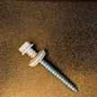 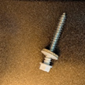 | 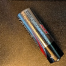 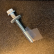 |
| :---: | :---: |
| *Examples of nominal images* | *Examples of anomalous images* |

**Pasta:**

| 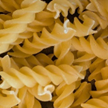 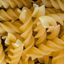 | 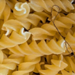 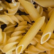 |
| :---: | :---: |
| *Examples of nominal images* | *Examples of anomalous images* |

**Capsules:**

| 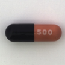 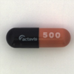 | 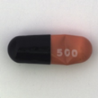 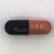 |
| :---: | :---: |
| *Examples of nominal images* | *Examples of anomalous images* |

## Testing Process

* The testing philosphy employed was to try to be as systematic as possible given time constraints, with the ultimate goal of comparing each design variation. 
* Averaging across 3 starting seeds for weight init was used to evaluate results. 
* An AUROC score using SSIM loss was used to evaluate the effectiveness of the models.

*The testing was not aided by hyperparam tuning aids such as 'Optuna' and 'scikit-learn'. We were not familiar with them at the time.*

### Testing Process
1. **Determine a decent CNN:** Evaluated different CNNs and their varying attributes. The primary goal at this stage was to find a 'good enough' model to serve as a foundation for testing the autoencoders. 
2. **Determine a decent reconstruction loss:** Limited comparison to MSE vs SSIM.
3. **Parameter Tuning:** Tested different parameters for the base models and any autoencoder specific parameters (ex: beta values, noise factor)
4. **Autoencoder Comparison:** Compared best results of each optimized autoencoder against the others.

## Findings

*Please see the 'Project Report' PDF in the main branch for a more comprehensive breakdown of the results.*

### CNN Findings 
* **Instance vs Batch Norm:** Instance norm outperformed batch norm. Given the small size of our data set, batch statistics were too variable. 
* **ReLu vs Leaky ReLu:** Leaky Relu with a slope of 0.2 yielded better results.
* **Latent Space Bottleneck:** A small bottleneck of 8 to 32 dimensions outperformed higher dimensions. We hypothesize this is mainly due to our small dataset. 

### Reconstruction Loss Findings
* On average Structural Similarity Index Measure (SSIM) outperformed performance over Mean Squared Error (MSE)
* However, MSE outperformed on the capsule dataset while SSIM outperformed significantly on the pasta. Highlighting the inductive bias of these two loss functions. 

### Autoencoder Comparison Findings
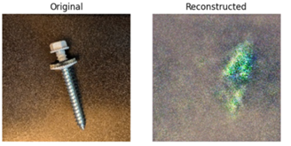 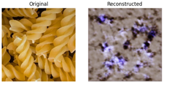 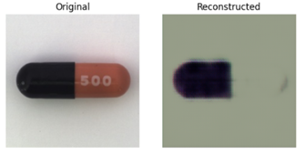 *Reconstructions from DAE* 

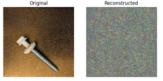 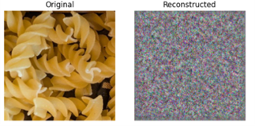 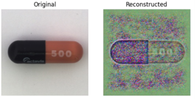 *Reconstructions from Beta-VAE*

Pictured above are the reconstructions from the two best performing models. Ultimately the Beta-VAE performed generally the best over the other designs.

## Areas to Improve

Baseline AUROC performance remained close to the random threshold of 0.5. Since our tested improvements only produced deviations of approximately ±0.2, this emphasizes that our project only achieved preliminary results.

**If this project was continued, future work would include:** 
* Changing evaluation metric (exploring outside of AUROC)
* Experimenting and improving more on the CNN design
* Conducting a more comprehensive hyperparamter check (using hyperparam tuning aids)
* Normalizing the images before passing them into the model
* Attempting different forms of weight initialization
* Analyzing visual results more (error detection heat maps)

## Conclusion

Ultimately, it is hard to find a single design that works generally well for every dataset and every anomaly, especially with sparse training examples and limited time. 

It was most interesting to see in practice how different models performed better on certain dataset problems. This reaffirms the **"No Free Lunch" theorem**, which states that no single algorithm is universally superior.  

## Authors

Alanna Cunha

Tara Golonka
